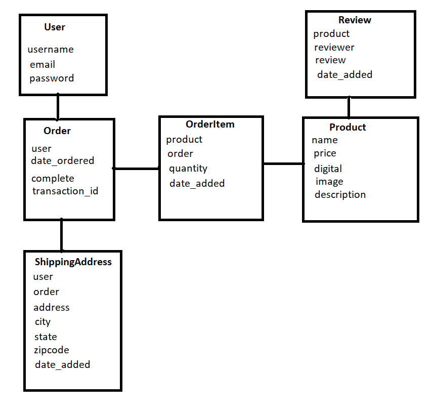

# E-commerce

Video Demonstration of the app: https://youtu.be/bOfClMkb2wo

#### Project Based on: https://codewithsteps.herokuapp.com/project/cd0492f3-ee93-471a-9dbc-b047233336c3/#overview
* This project will be a fully functional eCommerce website with user and guest checkout capabilities, using cookies. Users will have the abililty to add multiple products to cart varying from physical to digital products. Payment integration will be handled with PayPal offering the ability checkout with a PayPal account and debit/credit card. 

#### Added Functionality
* Complete User Registration System, Login, Logout.
* Individual product page where logged in user can write/edit reviews and/or look at other user reviews.
* Option to Buy Now/Add to cart from the individual product page.
* Give the ability for logged in users to add their own products to sell

### Fig: Model of the database.

